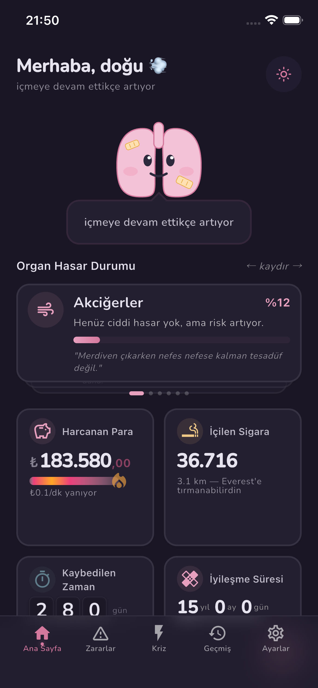
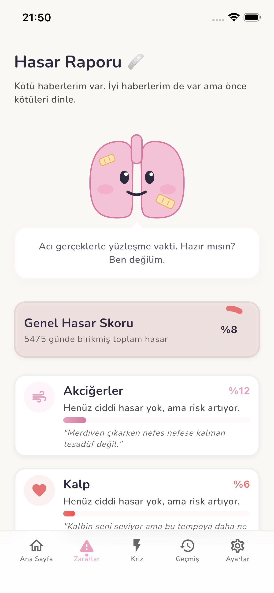
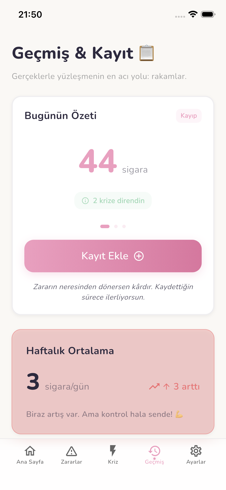
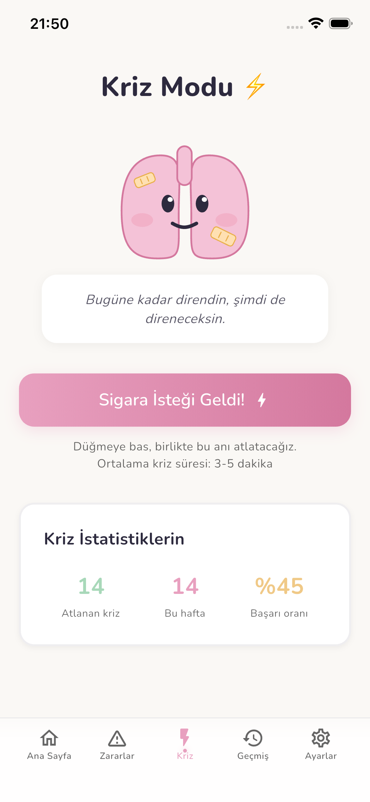

<p align="center">
  
</p>

<h1 align="center">Luno 🫁</h1>

<p align="center">
  <strong>"Acı Gerçeklerle Yüzleştiren" Sigara Bırakma Farkındalık Uygulaması</strong><br/>
  <em>Klasik motivasyon yöntemlerini bir kenara bırakın. Ciğerito ile gerçek hasarı görmeye hazır mısın?</em>
</p>

<p align="center">
  <a href="https://flutter.dev"></a>
  <a href="https://firebase.google.com"></a>
  <a href="https://riverpod.dev"></a>
  
</p>

---

## 🌬️ Luno Nedir?

Luno, sigara bırakma sürecinde sizi "tebrik etmek" yerine, devam ettiğiniz her anın size ve bütçenize verdiği **net zararı** yüzünüze vuran bir farkındalık platformudur. Uygulamanın kalbinde, tatlı ama yaralı, bazen alaycı bazen de bilge maskotumuz **Ciğerito** yer alır.

> _"Her sigara hayatından 11 dakika çalar. Ama sen zaten zamanı dumanla harcamayı seviyorsun, değil mi?"_
> — **Ciğerito**

---

## 📱 Ekran Görüntüleri

| **Dashboard (Koyu Tema)** | **Hasar Raporu** | **Kriz Modu** | **Geçmiş & Kayıt** |
| :---: | :---: | :---: | :---: |
|  |  |  |  |

---

## ✨ Temel Özellikler

### 📊 Dinamik Dashboard
*   **Gerçek Zamanlı Kayıp Takibi:** Harcanan para, içilen sigara ve kaybedilen zamanı canlı olarak izleyin.
*   **Görsel Karşılaştırmalar:** İçtiğiniz sigaraların toplam uzunluğunu "Everest'e tırmanış" gibi çarpıcı metriklerle görün.
*   **Kayıp Animasyonları:** Paranızın nasıl "yandığını" gösteren dinamik progress bar'lar.

### 🫁 Detaylı Hasar Raporu
*   **Organ Bazlı Analiz:** Akciğer, Kalp, Beyin ve Cilt üzerindeki birikmiş hasarı yüzde bazlı takip edin.
*   **Farkındalık Cümleleri:** Ciğerito'nun her organ hasarına özel, iğneleyici ama gerçekçi yorumlarıyla yüzleşin.

### ⚡ Kriz Modu
*   **Acil Destek:** Sigara içme isteği geldiğinde sizi durduracak özel bir "Kriz Bölgesi".
*   **İstatistikler:** Kaç krizi atlattığınızı ve başarı oranınızı takip ederek özgüveninizi artırın.

### 📅 Geçmiş ve Kayıt Yönetimi
*   **Günlük Check-in:** Her gün kaç sigara içtiğinizi veya kaç krize direndiğinizi kolayca kaydedin.
*   **Haftalık Analiz:** Verilerinizin haftalık değişimini kontrol ederek gidişatınızı görün.

### 🎨 Kişiselleştirme ve Tema
*   **Koyu/Açık Mod:** Göz yormayan şık karanlık tema desteği (Hive ile kalıcı tercih).
*   **Profil Yönetimi:** Sigara fiyatı ve günlük tüketim gibi verileri güncelleyerek hesaplamaları kişiselleştirin.

---

## 🏗️ Mimari ve Teknik Yapı

Luno, modern Flutter standartlarına uygun olarak **Feature-First** mimarisiyle geliştirilmiştir.

*   **State Management:** Veri akışı ve uygulama durumu **Riverpod** ile yönetilir.
*   **Veri Katmanı:**
    *   **Uzak Veri:** Firebase Firestore (Profil ve Log senkronizasyonu).
    *   **Yerel Veri:** Hive (Hızlı erişim, tema ve cache yönetimi).
*   **Tasarım:** Tamamen özelleştirilmiş `LunoCard`, `SettingsSlider` ve animasyonlu bileşenler.

```text
lib/
├── core/                # Tema, sabitler, ortak bileşenler
├── features/            # Modüler özellikler
│   ├── auth/            # Firebase Auth & Profil
│   ├── dashboard/       # Ana sayfa ve hesaplamalar
│   ├── damage/          # Hasar analizi ekranları
│   ├── history/         # Kayıt ve istatistik
│   └── settings/        # Uygulama ayarları & Tema
└── app.dart             # Ana uygulama yapılandırması
```

---

## 🚀 Hızlı Başlangıç

1.  **Depoyu Klonlayın:**
    ```bash
    git clone https://github.com/dogualagoz/luno_quit_smoking_app.git
    ```
2.  **Bağımlılıkları Yükleyin:**
    ```bash
    flutter pub get
    ```
3.  **Firebase Kurulumu:**
    Projenin Firebase entegrasyonu için `firebase_options.dart` dosyasını kendi projenize göre yapılandırmayı unutmayın.
4.  **Uygulamayı Çalıştırın:**
    ```bash
    flutter run
    ```

---

<p align="center">
  <strong>Ciğerito seninle birlikte.</strong> 🫁<br/>
  <em>"Bırakma yolculuğun zor olabilir. Ama en azından yalnız değilsin... Ben de nefes alamıyorum."</em>
</p>
